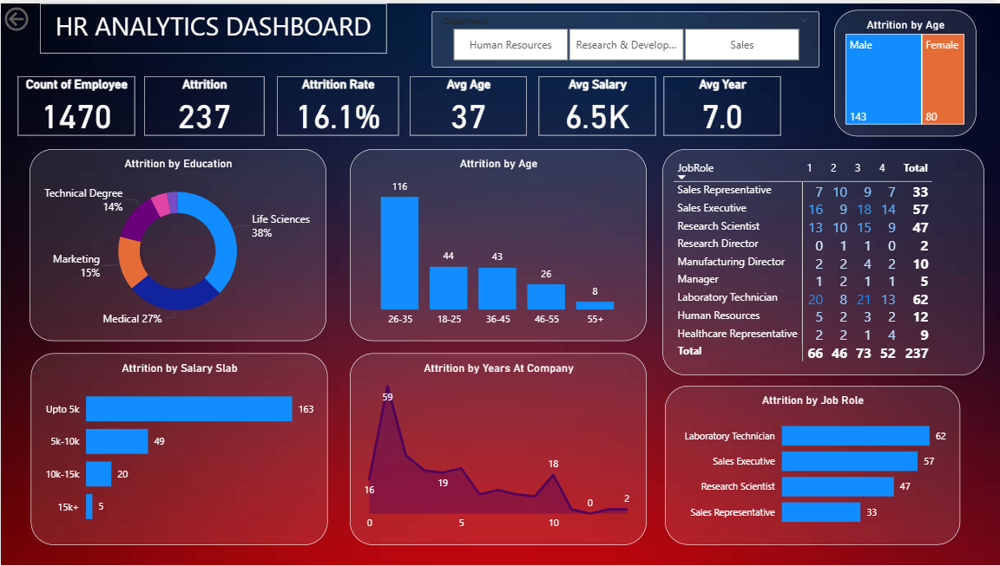

# Power-BI-dashboard-poject
A Power BI–based HR Analytics KPI Dashboard providing actionable insights into employee attrition, salary distribution, demographics, and tenure. Designed for HR teams to track key performance indicators, identify workforce trends, and support data-driven decision-making for improved retention and organizational efficiency.

# HR Analytics KPI Dashboard

## Project Overview
This project presents a comprehensive **HR Analytics Dashboard** designed to monitor and analyze key workforce metrics for the organization.  
It serves as a **KPI (Key Performance Indicator) report** to support data-driven decision-making by the HR department and company leadership.

The dashboard highlights patterns in employee attrition, salary distribution, demographics, and tenure, enabling management to identify workforce trends, address retention challenges, and improve HR strategies.

---

## Key Insights & Features
- **Workforce Summary**
  - Total Employees: **1470**
  - Attrition Count: **237**
  - Attrition Rate: **16.1%**
  - Average Age: **37 years**
  - Average Monthly Salary: **$6.5K**
  - Average Tenure: **7 years**
  
- **Attrition Analysis**
  - By **Education**: Life Sciences, Medical, Marketing, Technical Degree, etc.
  - By **Age Group**: 26–35, 18–25, 36–45, 46–55, 55+
  - By **Salary Slab**
  - By **Years at Company**
  - By **Job Role**

- **Department & Gender Filters** to refine insights.

---

## Dashboard Preview

---

## Purpose
- Identify **high-risk attrition groups** based on age, salary, education, and tenure.
- Track **HR performance metrics** to align with business goals.
- Assist leadership in **formulating retention strategies**.
- Provide **data-backed insights** for workforce planning.

---

## Tools & Technologies
- **Power BI** – Dashboard design & visualization  
- **Excel / CSV** – Data source  
- **Data Cleaning** – Power Query  
- **KPI Tracking** – Custom measures & DAX formulas

---

## Outcome
This HR KPI Dashboard enables the organization to:
- Reduce attrition by targeting critical employee segments.
- Optimize salary structures.
- Improve hiring and retention strategies.
- Enhance overall workforce management efficiency.
